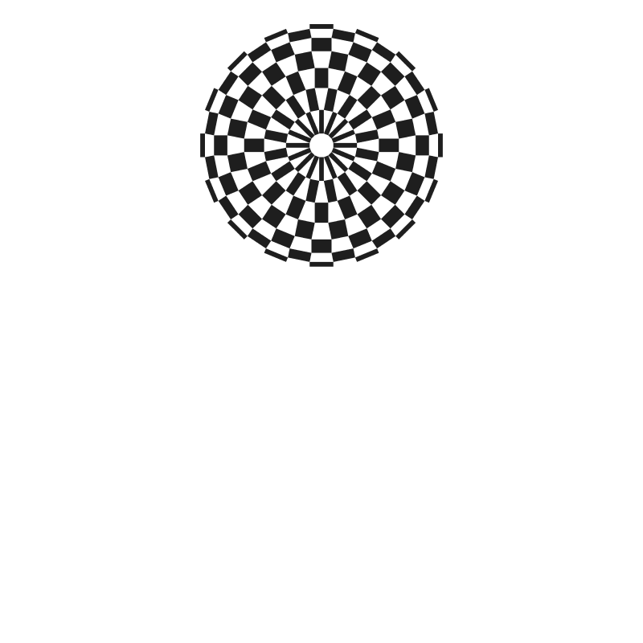
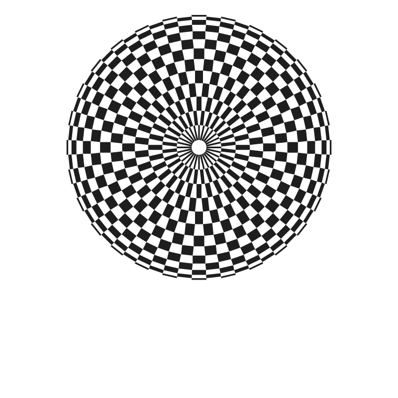
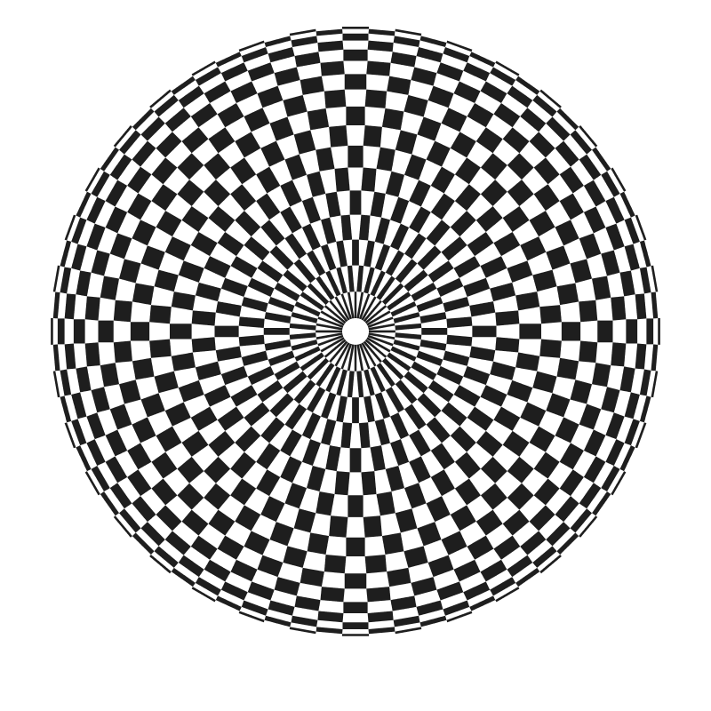

# 組市松紋の基本形を拡張するサンプル１

このサンプルでは、任意の頂点数の円形組市松紋を描くことができます。

## 頂点数の変え方

1行目の VNUMが頂点の数です。

### 頂点数6の場合

~~~

int VNUM = 6

~~~

### 頂点数8の場合

~~~

int VNUM = 8

~~~

### 頂点数16の場合

~~~

int VNUM = 16

~~~

### 頂点数28の場合

~~~

int VNUM = 28

~~~

### 頂点数36の場合

~~~

int VNUM = 36

~~~

## 円の大きさの変え方

2行めのDIAMETERを変えてください。

~~~

float DIAMETER = 30;

~~~

DIAMETERは、組市松紋を構成する、ひとつひとつの四角形が内接する円の直径です。

DIAMETERが同じでも頂点数が多くなれば全体の円は大きくなります。

