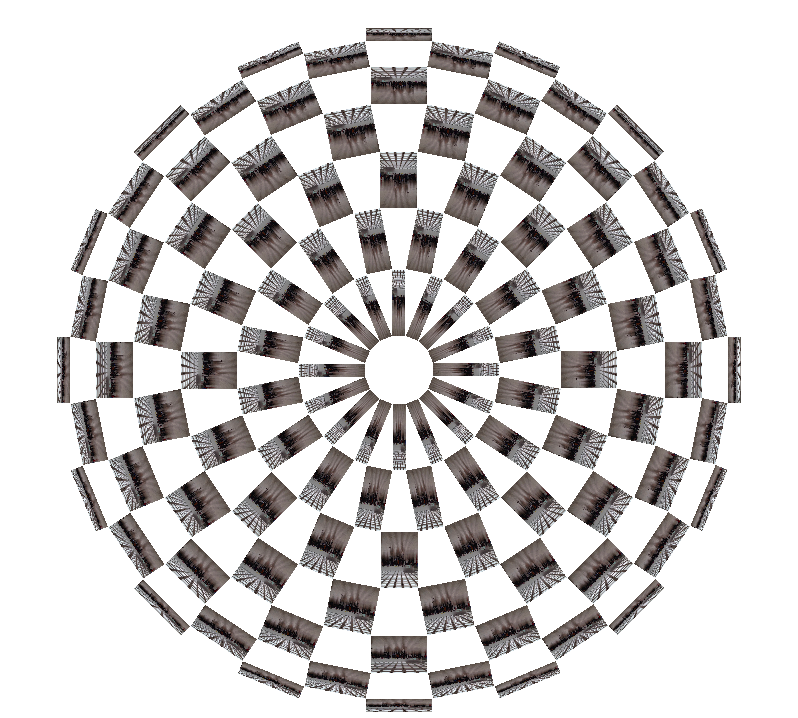

## 組市松紋の基本形を拡張するサンプル２

# 組市松紋の四角の部分を画像で置き換える

## 頂点数の変え方

組市松紋の基本形を拡張するサンプル１とおなじ。

[組市松紋の基本形を拡張するサンプル１](https://github.com/CreativeVisualization/Saturday-Class/tree/master/workshop_tokyo2020/examples/round_lattice01)

## 円の大きさの変え方

組市松紋の基本形を拡張するサンプル１とおなじ。

[組市松紋の基本形を拡張するサンプル１](https://github.com/CreativeVisualization/Saturday-Class/tree/master/workshop_tokyo2020/examples/round_lattice01)

## 画像の読み込み

17行目辺り

~~~

  //画像の読み込み 参照：https://processing.org/reference/PImage.html
  photo = loadImage("photo.png");
  
~~~

## 画像の描画

43行目辺り

~~~ 

void drawRect(PVector vec){

  //画像をリサイズして表示 視覚を埋め尽くすようにリサイズ
  //参照 https://processing.org/reference/image_.html
  image(photo,0,0,vec.x,vec.y);
}

~~~

