東京オリンピック・パラリンピック2020 エンブレムをコードする 第1回授業資料　2016/04/30

# 1. エンブレムをコードで記述し再現する。

コードで再現する方法を見つけることで、その形の構造や成り立ちが視覚化・言語化できる。まず再現を試みて、その後、展開や応用を考えてみよう。

## 1-1. エンブレムをよく観察してみる。

[東京2020大会エンブレム](https://tokyo2020.jp/jp/games/emblem/)

* 正円に収まっている。
* 3つの四角形で構成されている。
* どちらも細長い長方形が18個、太い長方形が18個、正方形が9個で構成されている。
* 四角形の頂点同士が接している。
* 120°で同じパターンが繰り返し出現しているっぽい（オリンピックの方）
* etc...

120°で同じパターンが繰り返している様子（画像制作：田所さん）

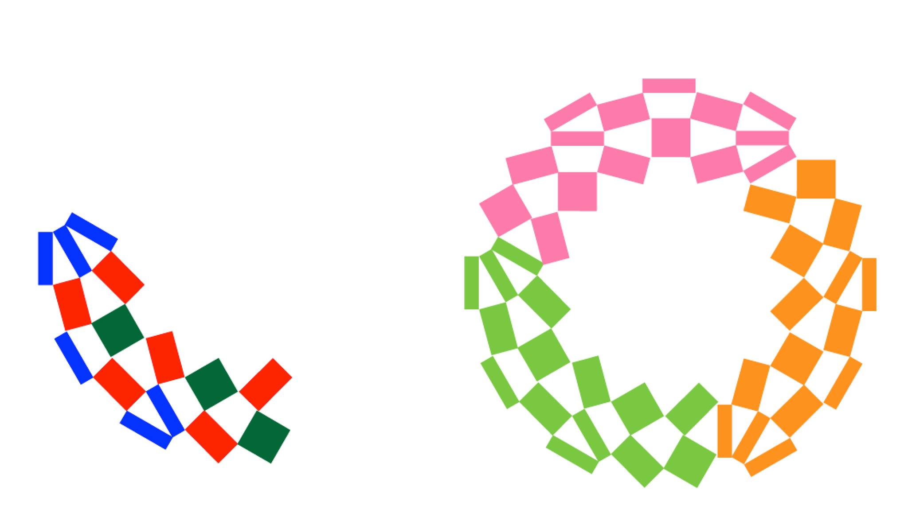

3つの四角形の基本の組み合わせ方（画像制作：田所さん）

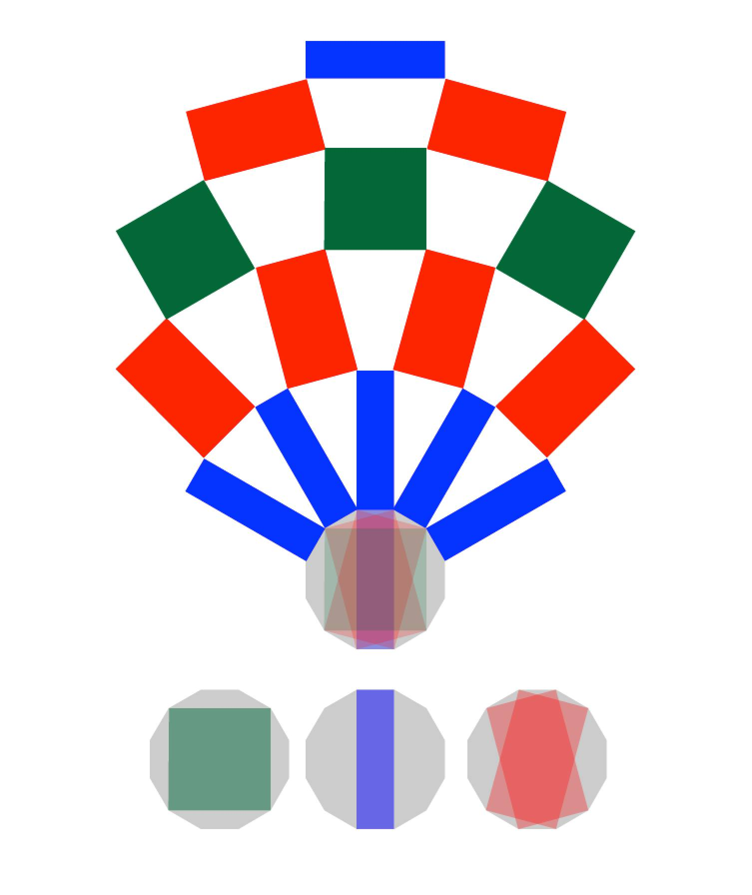

3つの四角形はいずれも正12角形の頂点を繋いだ四角形で、上図のように15°ずつ回転させて頂点同士をつなげることで基本パターンが描ける。正12角形の直径を1と仮定した場合に、それぞれの四角形の長辺の長さと短辺の長さを計算してみよう。

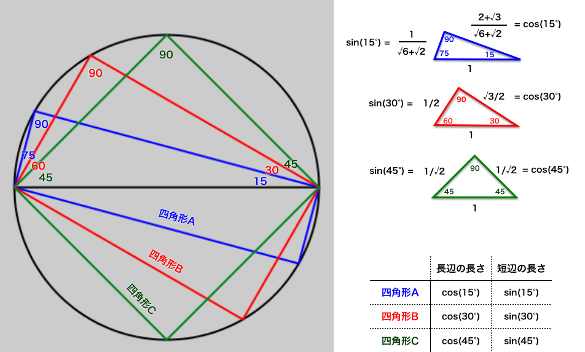

## 1-2. 基本パターンを描いてみる。

processingで基本パターンを描いてみる。

基本パターン

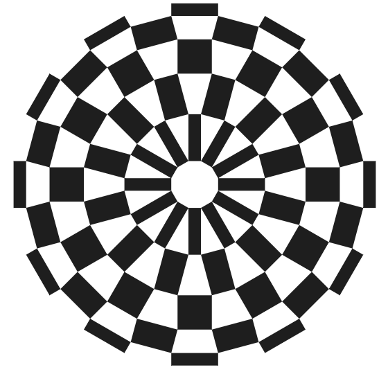

## 1-2-1. まずは外環を描く

四角形Aと四角形Bでできている外環を描く。

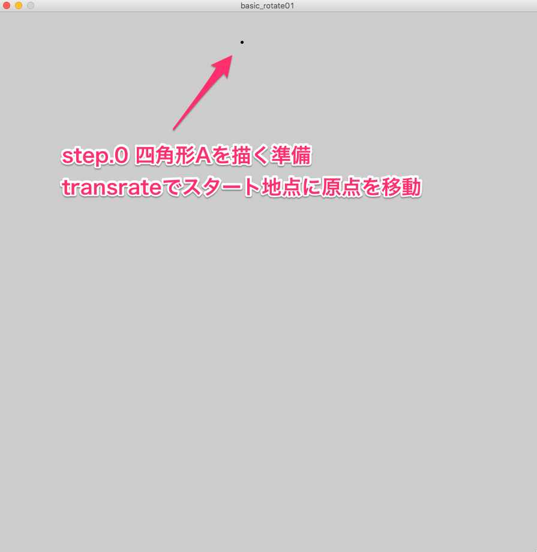

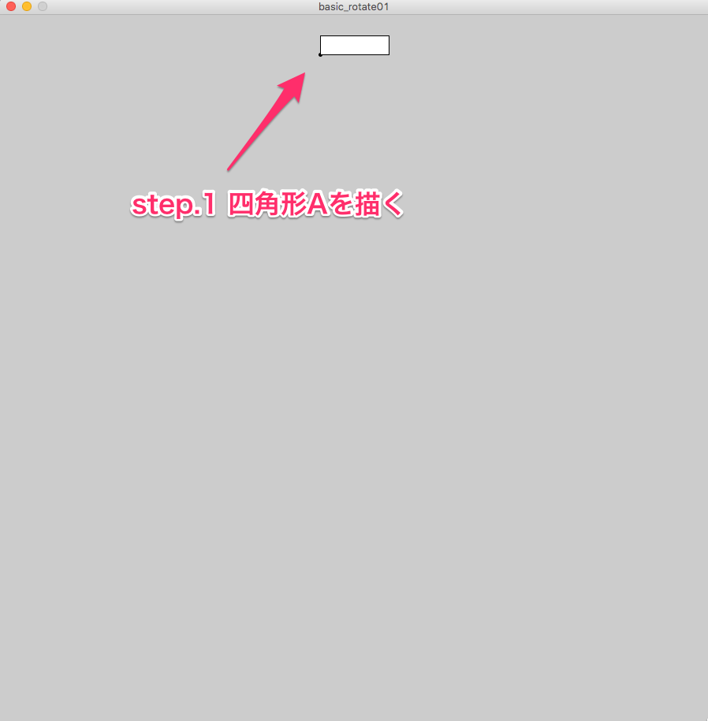

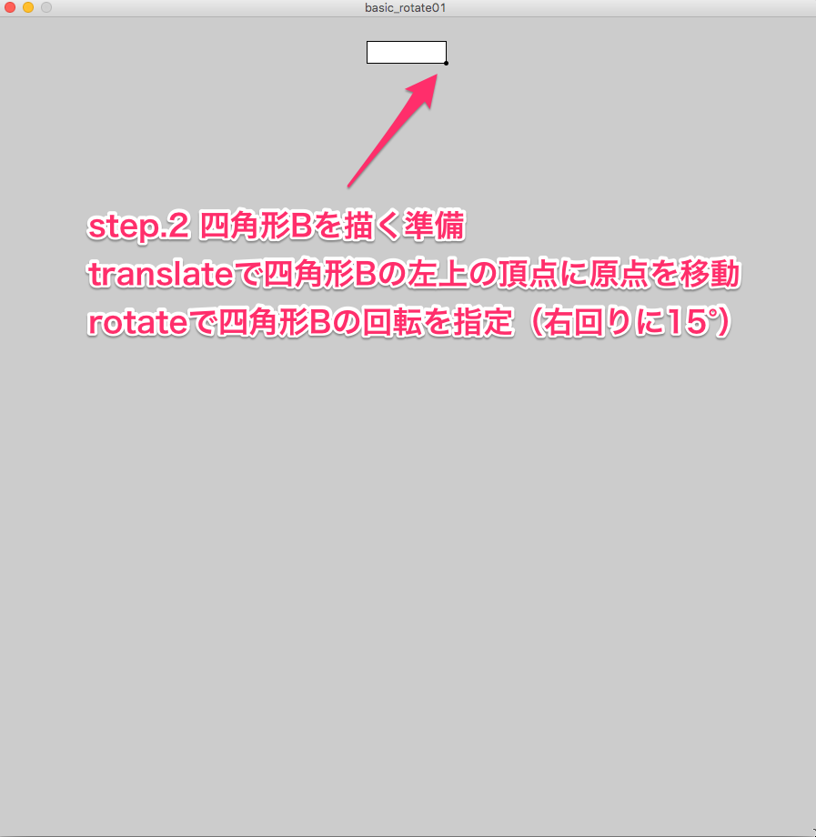

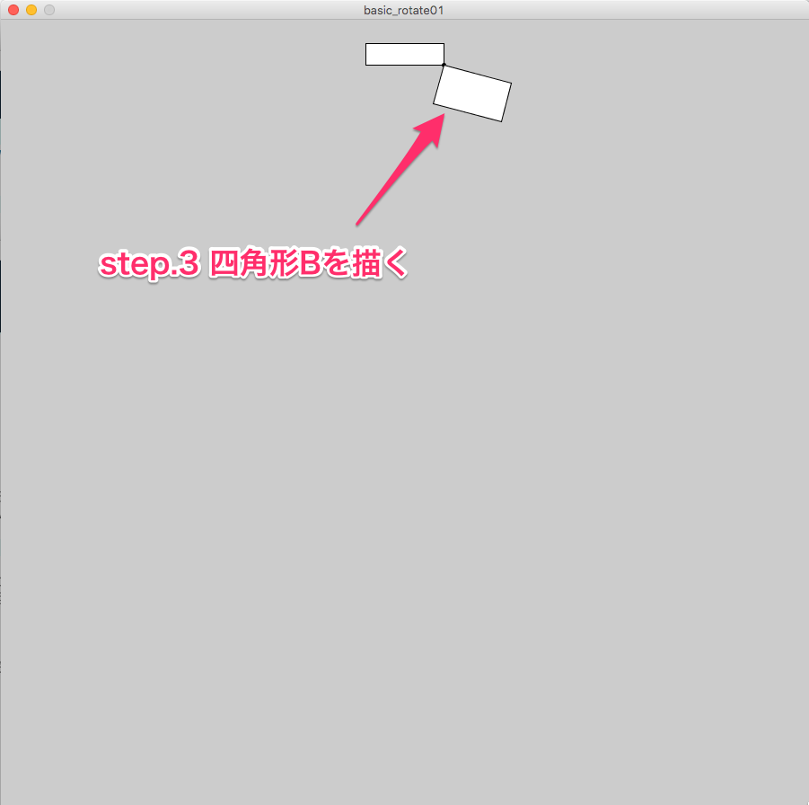

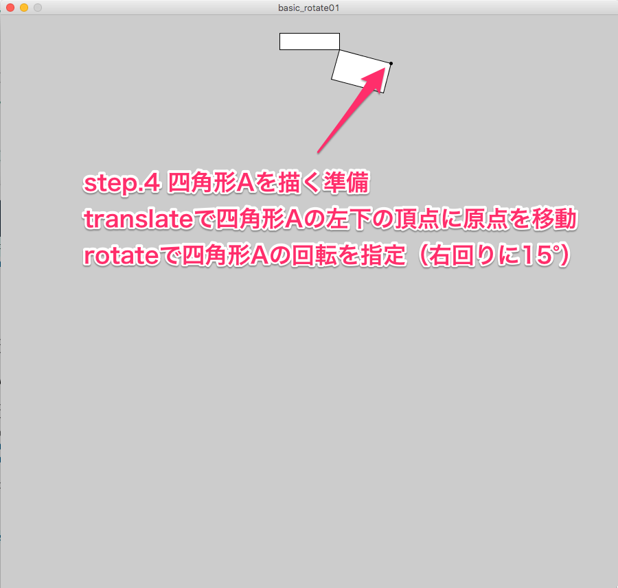

ステップ1〜4をfor文で12回繰り返す。

完成形！

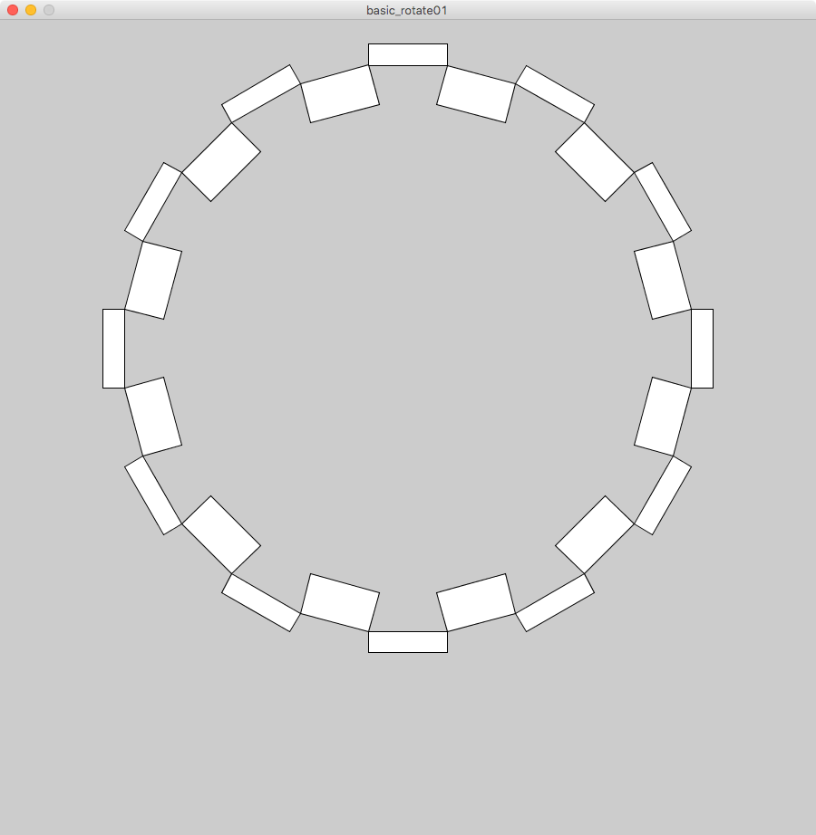

サンプルコード（[basic_rotate01](examples/basic_rotate01)）

## 1-2-2. 内部の環を描く。

外環（黒い部分）の描画が終わったので、内部の環（グレーの部分）を描く。

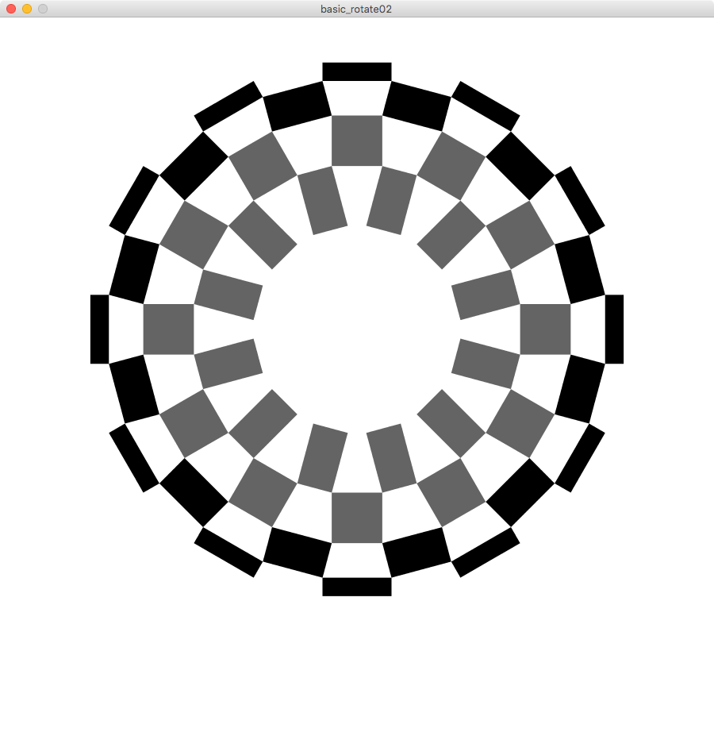

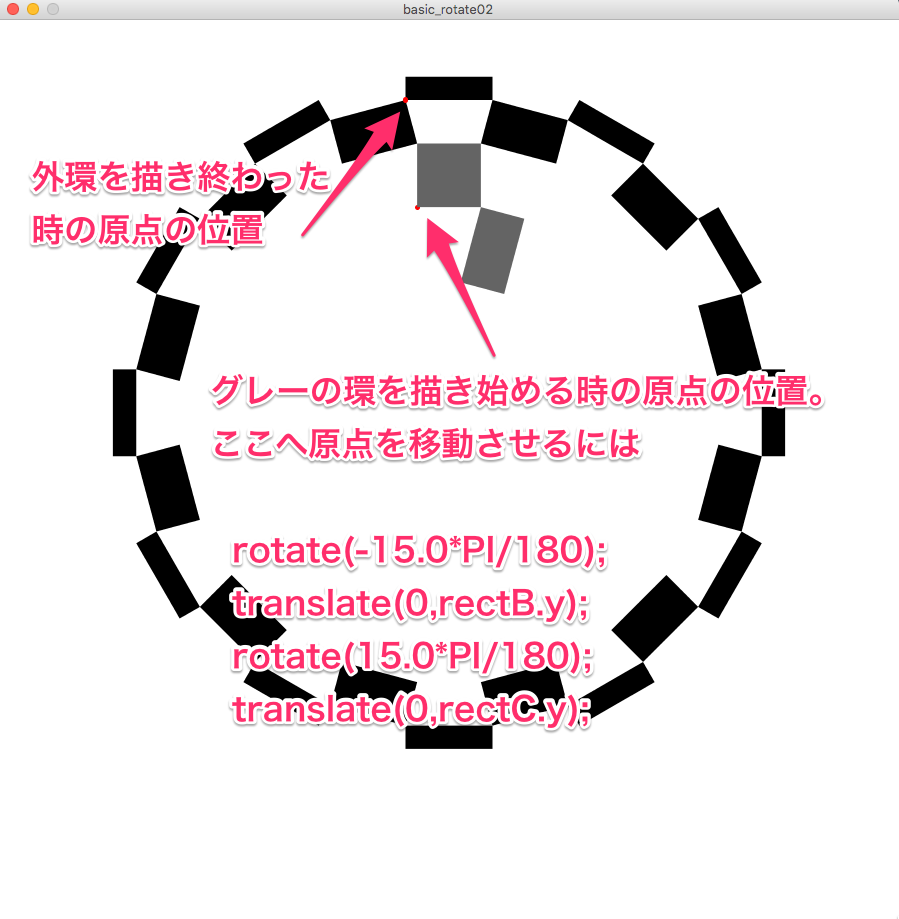

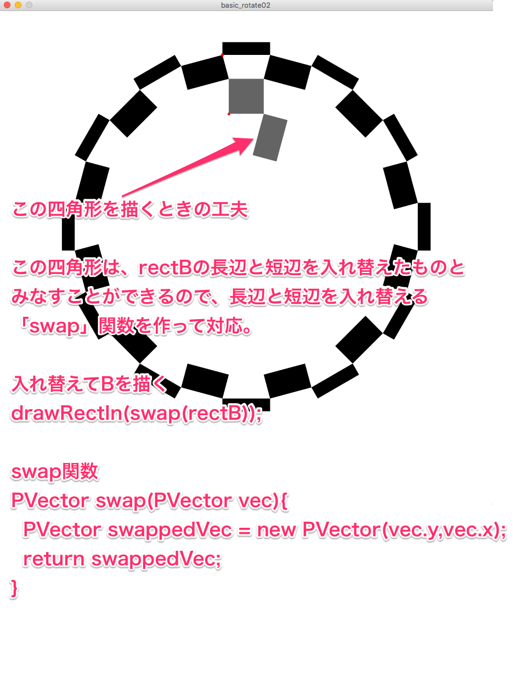

グレーの部分が描けたら、最後に中心の環を四角形Aの長辺と短辺を入れ替えた四角形で描いて終了。

完成形！

サンプルコード（[basic_rotate02](examples/basic_rotate02)）

***

## 参考資料

[東京2020大会エンブレム](https://tokyo2020.jp/jp/games/emblem/)

[パターンサンプル](http://bl.ocks.org/masakick/35cbc49f68e07f6bd40adbe128a6aa33)

[processingサンプル](examples)
